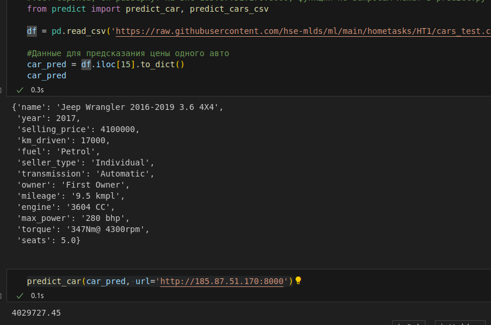
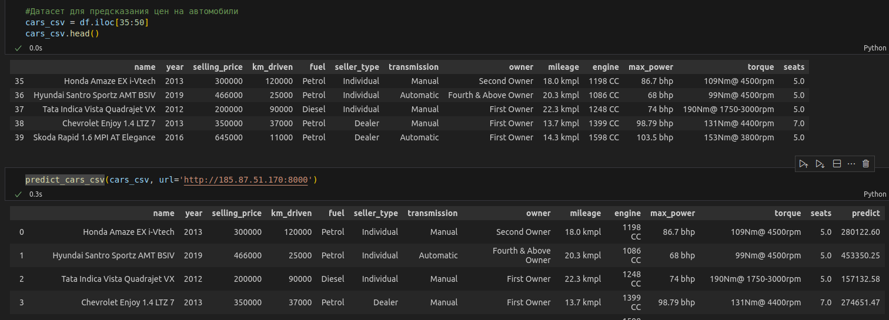

# Домашнее задание №1 
Чуприн Александр Сергеевич

# Структура репозитория
1. HW_1.ipynb - Ноутбук с проделанной работой
2. main.py - сервис с реализацией FastAPI
3. col.pickle - сериализованные колонки датасета
4. col_scaler.pickle - сериализованные колонки для скейлера
5. scaler.pickle - сериализованный скейлер
6. model.pickle - сериализованная модель (GridSearch + Feature Engineering)
7. requierements.txt - зависимости
8. dockerfile - докерфайл для FastApi
9. cars_test.csv - датасет для валидации
10. cars_train.csv - датасет для трейна
11. README.MD - ридми
12. License
13. Screens

# Что было сделано:
## EDA и обработка признаков
1. "Потрогали" данные, удалили дубли, пропуски заполнили медианами. 
2. Убрали еденицы измерения у mileage, engine, max_power и torque, удалил признак torque (простите меня). 
3. Преобразовали столбцы к подходящим типам данных. Провели визуализацию данных: pairplot, heatmap, по некоторым признакам построили отдельно диаграммы рассеяния

## Линейная модель на числовых признаках
1. С помощью библиотеки sklearn построили модели линейной регрессии, модель со скалированными значениями показала примерно такой же результат как и модель "как есть" r2 на тесте - 0,5941 в обоих случаях. 
2. Обучение Lasso-регрессии со стандартными значениями к успеху тоже не привели. При обучении с использованием грид-серча на 10 фолдах и кроссвалидацией с ласо-регргессией мы подобрали коэффицциент регуляризации равный 30000, при нем занулились веса в количестве 3шт, r2 на тесте вырос до 0.56.
3. Используя гридсерч мы обучили ElasticNet модель, которая комбинирует l1 и l2 регуляризацию, r2 на тесте вырос до 0.57

## Добавление категориальных признаков и обучение на новых данных
1. Добавили категориальные признаки и закодировали их с помощью метода get_dummies библиотеки Pandas.
2. Обучили регрессию с l2 регуляризацией используя гридсерч на 10 фолдах с кроссвалидацией, r2 на тесте вырос до 0.639

## Feature Engineering
1. Добавил признак - бренд, важный признак, который учитывает престижность марки
2. Распределение цены похоже на логнормальное - берем логарифм от цены
3. Все это закодировали, добавили недостающие категории в тест
4. Обучили модель, r2 на тесте вырос до 0,914
5. Сериализировали полученную модель и другие данные для создание сервиса FastApi

## Бизнесовая
Реализовал кастомную метрику по требованию заказчика

## Реализация сервиса на FastApi
1. Реализовал два post-метода
2. Код отдельно находится в файле main.py
3. Сервис развернут на удаленном сервисе [http://185.87.51.170:8000](http://185.87.51.170:8000)
4. Присутствует dockerfile для сборки контейнера с сервисом, либо готовый контейнер: chewye/ml_hse_ht1:1.03
5. Функции запроса (клиент) реализованы в файле predict.py, также в ноутбуке представлена демонстрация работы сервиса

## Выводы
1. Наилучший результат (буст) дал feature Engineering
2. Не хватило сил и возможно настроя на качественную и полную проработку "творческих заданий".

